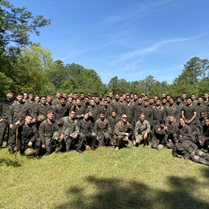

  

# Choosing Computer Science

Leaving the military, where I spent eight or more hours a day in weather conditions always being too hot or too cold, prompted a decisive shift in my career preferences. The desire for an indoor job led me to explore various options, and the logical world of computer science emerged as the ideal fit. Luckily for me it is not ideal to program in the blazing sun. The structured and evolving nature of computer science aligned seamlessly with my interest in rationality and the stability of the careers projected growth.

## The Future is Cybersecurity and AI

As I progressed through recent semesters, my focus within computer science expanded, leading me to develop a keen interest in the fields of cybersecurity and artificial intelligence. I see these domains as the driving forces behind the future of software development. The ever-evolving landscape of cybersecurity, with its emphasis on protecting digital systems, and the transformative potential of AI in enhancing software capabilities is an avenue I am only beginning to explore. These areas represent the biggest opportunities for innovation as we as a society are so heavily reliant on technology, where it is beneficial or detrimental is up for debate.

## Work vs Internships

Looking ahead, my trajectory involves a strategic approach to improve skill sets, engage in meaningful projects, and navigate the software engineering competitive job market. Acquiring project experience, however, remains a significant hurdle due to the constant demands of work. Despite these challenges, I am committed to exploring practical applications of my knowledge and I have started working on simple games using Java and Eclipse during my limited free time. This proactive approach is driven by my belief that coding under a bit of pressure is an optimal way to enhance one's problem-solving abilities.

## At the End of the Road

My end game extends beyond individual skill development. The aspiration to work for the government or potentially return to the military reflects a desire to contribute my expertise to impactful projects. This end goal serves as the driving force motivating me to navigate the challenges of software engineering with resilience and purpose. 
