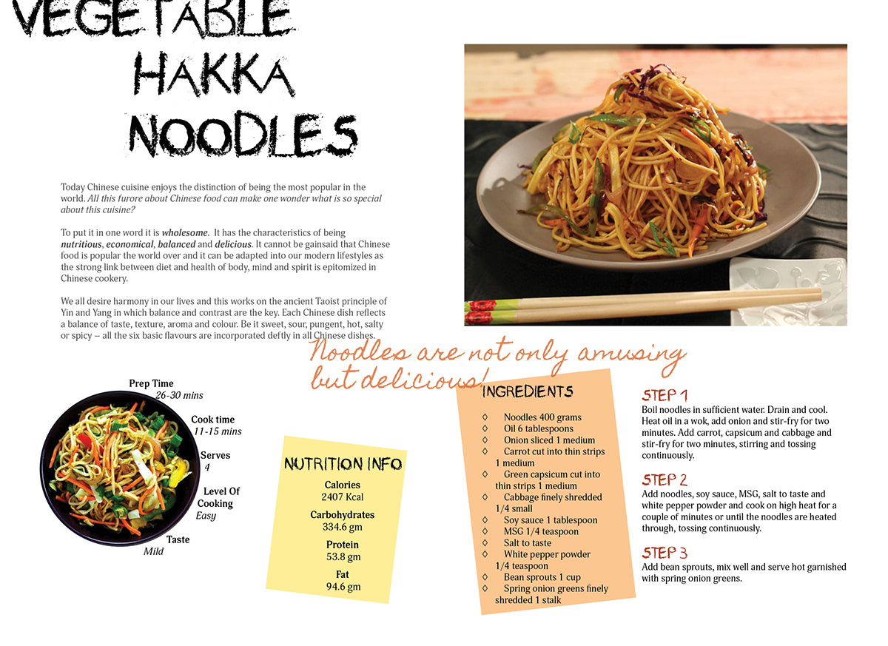

  

In the world of software development design patterns are like recipes in a chef's cookbook. They provide proven solutions to common problems encountered during the development process. Just as a chef relies on various techniques and ingredients to craft delicious dishes, a software engineer utilizes different design patterns to build efficient and elegant code.

## Understanding the Recipe

Imagine you're a chef preparing a complex dish. You encounter challenges like managing ingredients, coordinating cooking times, and ensuring the dish's presentation is appealing. Similarly, in software development, programmers face challenges such as managing code, ensuring flexibility, and maintaining scalability. Design patterns serve as the recipes that guide developers through these challenges, offering solutions that have been refined over time by more experienced developers. Just as there are different types of cuisine—Italian, Chinese, French—there are different categories of design patterns, each serving a specific purpose. Creating patterns are like the techniques for preparing the base ingredients of a dish, ensuring that objects are created in a flexible manner. 

## Cooking Up A Solution

In my experience using Github to develop a Manoa Fit Connect website each developer's branch in the group can be seen as an observer, monitoring changes made by other team members. When a team member commits changes to their branch and pushes them to the remote repository, other team members are notified of these updates. This setup reflects the dynamic communication between objects in the Observer pattern, where changes made by one component trigger updates in others.

## Mastering the Culinary Art of Software Design

Design patterns are the essential ingredients that make up the recipe for successful software development. By understanding and applying these patterns, we can better create code that is not only functional but also elegant and maintainable. Just as a chef's mastery of culinary techniques leads to delicious meals, a developer's proficiency in design patterns leads to efficient and robust software systems. So, whether you're cooking up a new application or whipping up a savory dish, remember the importance of design patterns—they're the secret sauce that makes everything come together.
