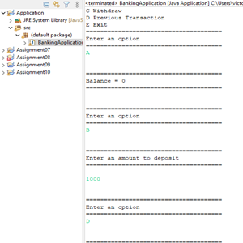

<div class="text-center p-4">
  
</div>

The project aimed to create a simple banking application using Java and Eclipse. The primary goal was to design a program that allows users to interact with their bank accounts through a text-based menu. The `BankAccount` class encapsulated key functionalities like deposit, withdrawal, balance inquiry, and displaying previous transactions. The main method in the `BankingApplication` class instantiated a `BankAccount` object, initialized it with customer details, and then invoked the `showMenu` method to provide an interactive menu for users. The program demonstrated fundamental Java concepts such as classes, methods, conditional statements, and user input handling, providing a practical example of a basic banking system.

In this project, my role encompassed the entire development process. I initiated the project by conceptualizing the structure of the banking application and defining the key functionalities it should include. Subsequently, I implemented the Java code using the Eclipse IDE, creating the `BankAccount` class and integrating it into the `BankingApplication` class. I was responsible for designing the user interface, managing user input, and ensuring the correct execution of banking operations. The development process involved debugging and refining the code to achieve a functional and user-friendly application. Additionally, I documented the code and ensured that it adhered to best practices in Java programming.

Through this experience, I gained valuable insights into Java development and software design. I enhanced my proficiency in object-oriented programming, especially in creating and utilizing classes. The project provided hands-on experience in user interface design and interaction, as well as error handling and debugging. Working on this banking application honed my skills in problem-solving and decision-making within the context of software development. Overall, the project served as a practical learning opportunity, allowing me to apply theoretical knowledge to create a tangible and functional Java application.


```cpp
class BankAccount{
	
	int balance;
	int previousTransaction;
	String customerName;
	String customerId;

	BankAccount(String cname, String cid){
		customerName= cname;
		customerId = cid;
	}
	
	void deposit(int amount) {
		
		if(amount != 0) {
			balance = balance + amount;
			previousTransaction = amount;
			
		}
	}
	void withdraw(int amount){
		if(amount != 0) {
			balance = balance - amount;
			previousTransaction = amount;
		}
	}
	void getPreviousTransaction() {
		if(previousTransaction > 0) {
			System.out.println("Deposited: " + previousTransaction);
		}
		else if (previousTransaction < 0) {
			System.out.println("Withdrawn: "+ Math.abs(previousTransaction));
		}
		else {
			System.out.println("No transaction occured");
		}
	}
	void showMenu() {
		
		char option = '\0';
		Scanner scanner = new Scanner(System.in);
		
		System.out.println("Welcome " +customerName);
		System.out.println("Your ID is "+ customerId);
		System.out.println("\n");
		System.out.println("A Check Balance");
		System.out.println("B Deposit");
		System.out.println("C Withdraw");
		System.out.println("D Previous Transaction");
		System.out.println("E Exit");
		
		do {
			System.out.println("======================================");
			System.out.println("Enter an option");
			System.out.println("======================================");
			option = scanner.next().charAt(0);
			System.out.println("\n");
			
			switch(option) {
			
			case 'A':
				System.out.println("======================================");
				System.out.println("Balance = "+ balance);
				System.out.println("======================================");
				System.out.println("\n");
				break;
			case 'B':
				System.out.println("======================================");
				System.out.println("Enter an amount to deposit");
				System.out.println("======================================");
				int amount = scanner .nextInt();
				deposit(amount);
				System.out.println("\n");
				break;
			case 'C':
				System.out.println("======================================");
				System.out.println("Enter an amount to withdraw");
				System.out.println("======================================");
				int amount2 = scanner .nextInt();
				deposit(amount2);
				System.out.println("\n");
				break;
			case 'D':
				System.out.println("======================================");
				getPreviousTransaction();
				System.out.println("======================================");
				System.out.println("\n");
				break;
			default:
				System.out.println("======================================");
				System.out.println("Invalid option please enter a different character");
				System.out.println("======================================");
				break;
			}
		}
		while(option != 'E');
		System.out.println("Thank you for using our services <3");
		
	}
}

```

