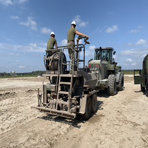
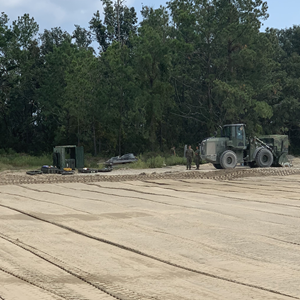

  
  
  

Under the blazing sun, our mission unfolded—transform a rough dirt lot into a precision training ground for UH-1Y pilots. The primary objectives included leveling the terrain near a runway and constructing four landing pads at varying degrees. Success hinged on careful planning and execution, involving the coordination of dirt deliveries and the strategic placement of fuel supplies. As the leader of a dedicated team of 10 Marines, my role was crucial in maintaining accountability and ensuring the consistent heavy equipment operations to construct the landing pads using technology like the Trimble laser system.

Navigating the intricacies of environmental regulations, I collaborated with experts to avoid wildlife ecosystems or encroaching on prohibited areas. Challenges arose when one of our vital pieces of equipment malfunctioned, leading to a potentially hazardous hydraulic spill near the landing pads. Quick thinking and decisive action were essential. The team managed to contain the spill, temporarily relocating the malfunctioning gear to a secure concrete pad. This experience emphasized the importance of preparedness and adaptability in the face of unexpected setbacks.

This project was not just a task; it was an opportunity for me to showcase my leadership skills, team mangement, and problem-solving abilities (with the help of some amazing peers). Over three intense weeks, with 10 individuals committing eight hours a day, we successfully transformed the landscape. Operating two graders, trams, compactors, MCTs, D6s, and scrapers we adhered to a strict timeline. In the end, it wasn't just about creating landing pads; it was about demonstrating resilience, ingenuity, and the ability to triumph over challenges as a united force.

