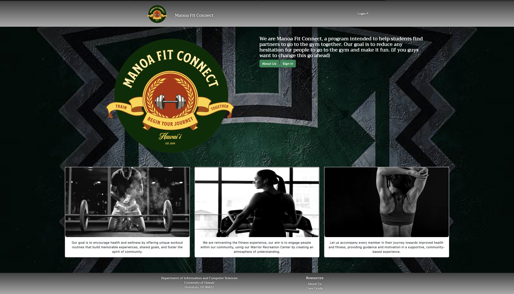
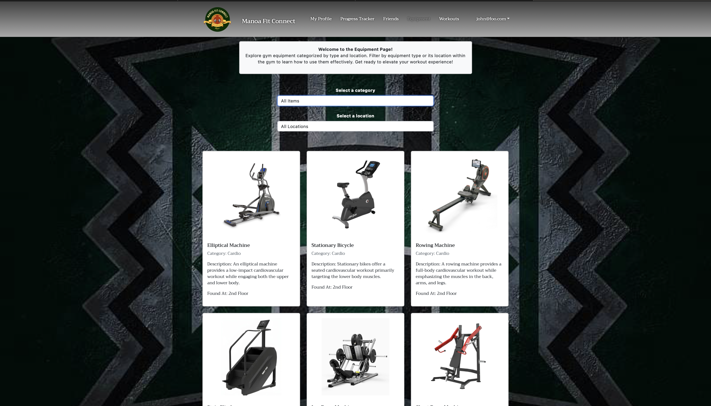
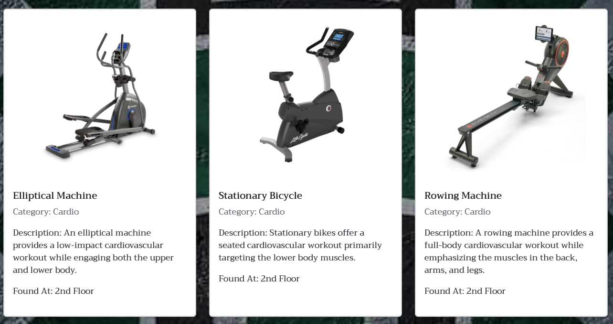
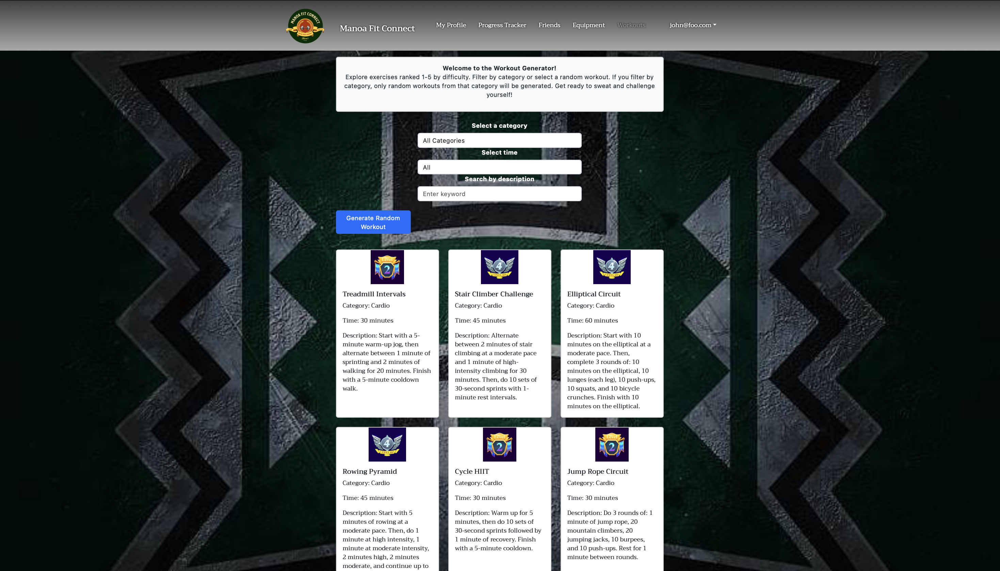
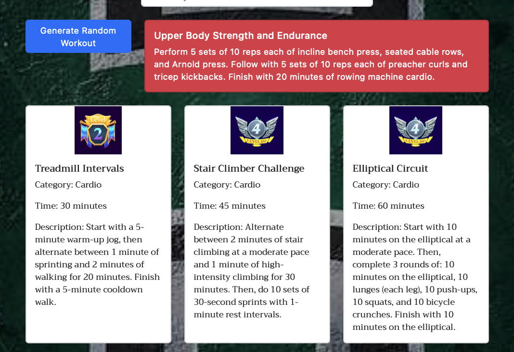

  

### Project Overview
The primary goal was to design an application that provided students information on gym equipment, workouts, and to connect them with other students with similar interests. We wanted to take away the worries that may come along with getting into fitness. Students can choose to use our app as their new workout buddy or we help to connect them with workout buddies.

  

  

### Development Process
In this project, my main role encompassed the equipment page and workout page. These required accumalating a large database for users to filter through. My goal was to keep these pages simple and easily accessable for our users. I also helped to develop the css style for our overall website including the heart generator at our signout page. This project was developed using Github branches with each member taking ownership of issues to commit to a main branch. We developed this applicatiion in three stages each improving the functionality of our application.

  
  

  

### A Learning Experience
Through this experience, I gained valuable insights into what is required to work with a team. For the most part it was everyones first time working in a group together. At times we had different approaches to implementing features but we were able to communicate and restrategize goals so they could be accomplished. Overall, I believe we made a strong effort to continously imporve our application and I wished we could have developed it further. Perhaps this is something I may work on for experience in the future.

### Further Exploration
If I could change anything about my pages it would be to allow users to submit workout that they could decide if they wwere avaiable to all users or just them. These would be able to be filtered with the rest of the workouts. I would of also liked to create a a page where users could provide feedback on their experience for ongoing improvements.

