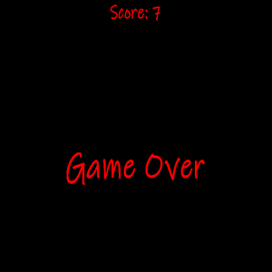
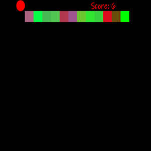

  
  

Welcome to my, and many peoples, first Java game the Snake Game, a captivating design project crafted in Eclipse. This project showcases the classic Snake Game mechanics but also incorporates advanced features, polished user interface, and efficient code architecture. The Snake Game is a timeless and the perfect game to play when pretending to look busy. It has a simple challenge lying in avoiding collisions with walls and the snake's own tail. The game engages players from the moment they launch the application. The colorful palette, intuitive layout, and smooth animations contribute to a visually appealing experience. My Snake Game is not confined to a fixed window size. It adapts seamlessly to various screen resolutions, ensuring an optimal gaming experience across different devices. As you progress you unlock different ranges of colors and the size of the playing screen and speed of the snake increases. Although I am the creator of this version I am not very good at the game and was not able to demonstrate the other color that could be unlocked from the images above.

